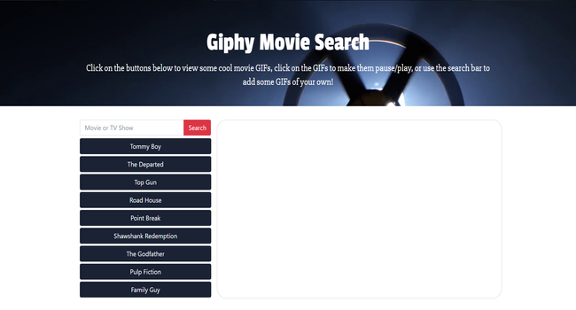

# GifTastic

## Description
A web app which uses the Giphy API to search for movie GIFs (or any GIF for that matter). Entering a search term will add a new GIF button. Clicking on the GIFs will play/pause them! Try it out here: https://khoernlein90.github.io/GifTastic/ Enjoy!

## Technologies Used
* HTML
* CSS 
* Bootstrap
* JavaScript
* jQuery
* Giphy API
* AJAX

